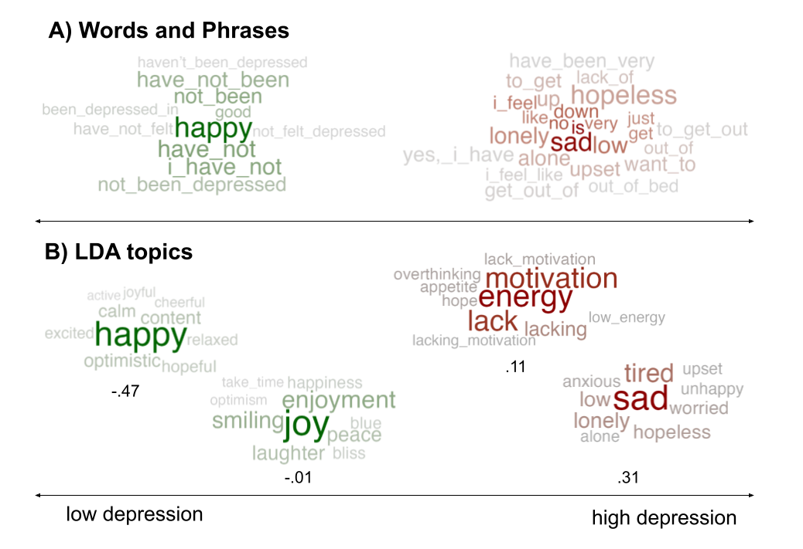

<!-- README.md is generated from README.Rmd. Please edit that file -->
<!-- badges: start -->

[](https://zenodo.org/doi/10.5281/zenodo.11165377)
[](https://github.com/theharmonylab/topics/actions)
[](https://www.repostatus.org/#active)
[](https://lifecycle.r-lib.org/articles/stages.html#maturing-1)
[](https://app.codecov.io/gh/theharmonylab/topics/)
[](https://CRAN.R-project.org/package=topics)
<!-- badges: end -->

# topics <a href="https://r-topics.org"></a>

## Overview

An R-package for analyzing natural language implementing Differential
Language Analysis using words, phrases and topics. The `topics` package
is part of the *R Language Analysis Suite*, including `talk`, `text` and
`topics`.

- [`talk`](https://www.r-talk.org/) transforms voice recordings into
  text, audio features, or embeddings.<br> <br>
- [`text`](https://www.r-text.org/) provides many language tasks such as
  converting digital text into word embeddings.<br> <br> `talk` and
  `text` offer access to Large Language Models from Hugging Face.<br>
  <br>
- [`topics`](https://www.r-topics.org/) visualizes language patterns
  into words, phrases or topics to generate psychological insights. <br>
  The `topics` package supports the `text` package in analysing and
  visualizing topics from BERTtopics.<br> <br>


<br> When using the `topics` package, please cite:

Ackermann L., Zhuojun G. & Kjell O.N.E. (2024). An R-package for
visualizing text in topics. <https://github.com/theharmonylab/topics>.
`DOI:zenodo.org/records/11165378`.

## Installation

The topics package uses <b>JAVA</b>, which is another programming
language. Please start by downloading and installing it from
`www.java.com/en/download/`. Then open R and run:

``` r
install.packages("devtools")
devtools::install_github("theharmonylab/topics")

# if you run in to any installation problem, try installing rJava first.

# Before open the library, consider setting this option (can increase 5000);  without it the code may ran out of memory
options(java.parameters = "-Xmx5000m")

```

## Table of Contents

1.  [Overview](#overview)
2.  [Installation](#installation)
3.  [Usage](#usage)

## Overview

The pipeline is composed of the following steps:

**1. Data Preprocessing**<br> The data preprocessing converts the data
into a document term matrix (DTM) and removes stopwords, punctuation,
etc. which is the data format needed for the LDA model.

**2. Model Training**<br> The model training step trains the LDA model
on the DTM with a number of iterations and predefined amount of topics.

**3. Model Inference**<br> The model inference step uses the trained LDA
model to infer the topic term distribution of the documents.

**4. Statistical Analysis**<br> The analysis includes the methods like
linear regression, binary regression, ridge regression or correlation to
analyze the relationship between the topics and the prediction variable.
It is possible to control for a number of variables and to adjust the
p-value for multiple comparisons.

**5. Visualization**<br> The visualization step creates wordclouds of
the significant topics found by the statistical analysis.


<br> <br> <br>


<br> <br>
